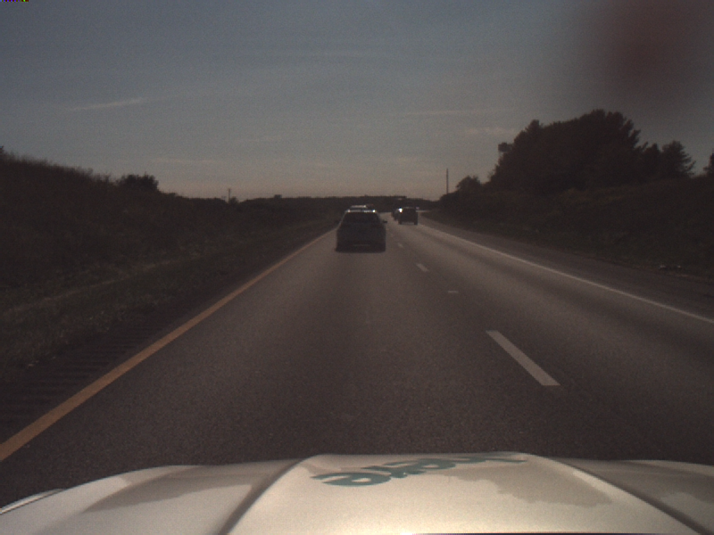
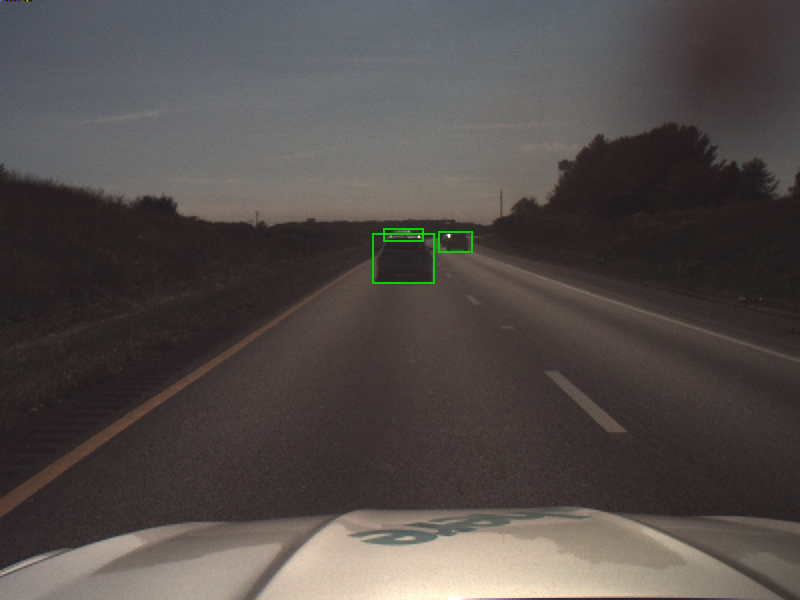

# Rosbag image processing using Amazon Managed Workflows for Apache Airflow (MWAA)
This solution describes a workflow that processes ROS bag files on Amazon S3 (https://aws.amazon.com/s3/), extracts individual PNGs from a video stream using AWS Fargate (https://aws.amazon.com/fargate) on Amazon Elastic Container Service (https://aws.amazon.com/ecs) (Amazon ECS), uses Amazon Rekognition (https://aws.amazon.com/rekognition/) to detect objects within the exported images and draws bounding boxes for the detected objects within the images.

Image extracted from ROS bag file:

Image after highlighting bounding boxes of detected objects

### Prerequisites

* Prepare an AWS account (https://aws.amazon.com/premiumsupport/knowledge-center/create-and-activate-aws-account/) to be used for the installation
* AWS CLI (https://aws.amazon.com/cli/) installed and configured to point to AWS account (https://docs.aws.amazon.com/cli/latest/userguide/cli-chap-configure.html)
* Use a named profile (https://docs.aws.amazon.com/cli/latest/userguide/cli-configure-profiles.html) to access your AWS account
* Install the AWS Cloud Development Kit (https://aws.amazon.com/cdk/)
* Our example uses Python version 3.9 or newer
* Docker (https://www.docker.com/) installed and running
* Download the sample Rosbag file from (TODO include link to S3)

### Deployment
Start the deployment by typing

`./deploy.sh <named-profile> deploy true <region>`

Replace `<named-profile>` with the named profile which you configured for your AWS CLI to point to your target AWS account. 
Replace `<region>` with the region that is associated with your named profile.

As an example: If your named profile for the AWS CLI is called `rosbag-processing` and your associated region is `us-east-1` the resulting command would be:

`./deploy.sh rosbag-processing deploy true us-east-1`

After confirming the deployment CDK will take several minutes to synthesise the CloudFormation templates, build the Docker image and deploy the solution to the target AWS account.

