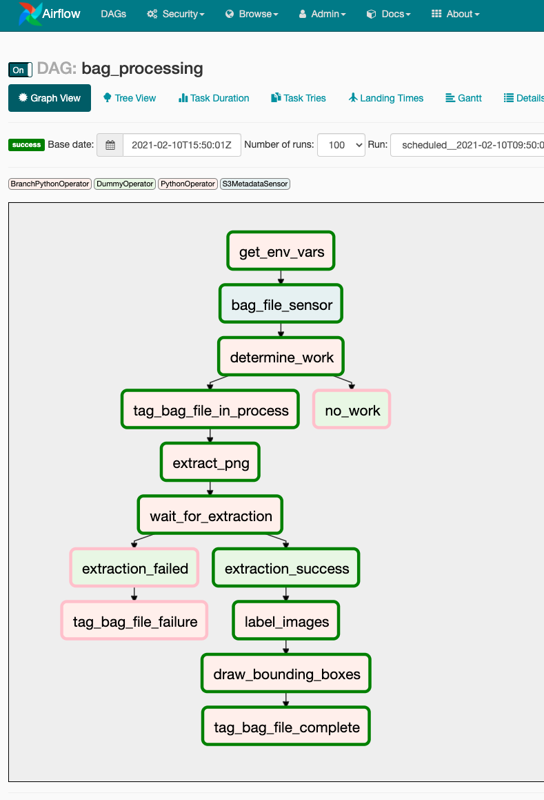

# Rosbag image processing using Amazon Managed Workflows for Apache Airflow (MWAA)

## Rosbag image processing workflow


## Results

The pipeline extracts individual PNGs from the Rosbag's video stream


The images are handed over to [Amazon Rekognition](https://aws.amazon.com/rekognition/?nc=sn&loc=0&blog-cards.sort-by=item.additionalFields.createdDate&blog-cards.sort-order=desc) for [Labeling](https://docs.aws.amazon.com/rekognition/latest/dg/labels.html)

Amazon Rekognition creates a JSON response with all labels detected in an image:
```json
[
  {
    "Name": "Car",
    "Confidence": 91.05919647216797,
    "Instances": [
      {
        "BoundingBox": {
          "Width": 0.09147811681032181,
          "Height": 0.10229308903217316,
          "Left": 0.47688964009284973,
          "Top": 0.3932057321071625
        },
        "Confidence": 91.05919647216797
      }
    ],
    "Parents": [
      {
        "Name": "Vehicle"
      },
      {
        "Name": "Transportation"
      }
    ]
  }
  ...
]
```


The detected labels are highlighted in the extracted images using bounding boxes.


